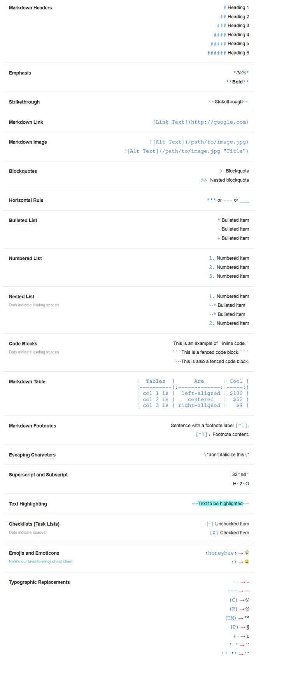

# Bestandsformaten

## Introductie
Dit bestand bevat voorbeelden van een aantal bestandsformaten. Deze voorbeelden zijn gebaseerd op onderzoek wat op het internet gedaan is. Voor elk voorbeeld wordt omschreven welke informatie uit het formaat gehaald kan worden.

De volgende bestandsformaten worden gedocumenteerd in dit document
* Markdown
* JSON
* XML
* CSV
* SVG
* YAML
* TOML

## Voorbeelden

### Markdown
Markdown is een gemakkelijk te gebruiken taal waarmee men tekstopmaak kan toevoegen aan tekst, zonder dat er een tekst bewerkings programma of HTML tags gebruikt hoeven te worden. Markdown zorgt ervoor dat de tekst op elk apparaat consistent getoond wordt. Dit bestand is een voorbeeld van hoe Markdown gebruikt kan worden. In dit bestand word gebruik gemaakt van de functionaliteiten van Markdown. De verschillende functionaliteiten kunnen gevonden worden in de volgende afbeedling: 

[Bron](https://www.ibm.com/docs/en/SSYKAV?topic=train-how-do-use-markdown), geraadpleegd op 03-09-2024.

### JSON
JSON of JavaScript Object Notation is een formaat waarmee data opgeslagen en verstuurd kan worden. Het wordt vaak gebruikt om data van een server naar een client of web pagina verstuurd wordt.
#### Syntax
Data wordt omschreven met een naam en value en wordt gescheiden middels een comma. De data bevind zich binnen accolades. Wanneer er meer data is, wordt dit binnen vierkante haken geschreven. Bijvoorbeeld:
```
{
    "Gebruikers":[
        {"Firstname":"John", "Age":30}
        {"Firstname":"Anna", "Age":25}
        {"Firstname":"Peter", "Age":36}
    ]
}
```
[Bron](https://www.w3schools.com/whatis/whatis_json.asp), geraadpleegd op 03-09-2024

### XML
XML staat voor eXtensible Markup Language. Het is ontworpen voor het opslaan en transporteren van data en beschrijft zichzelf. XML zelf doet niks, het is alleen informatie die opgeslagen is in tags. Als de informatie verstuurd moet worden, moet de persoon zelf de software hiervoor schrijven. XML is vergelijkbaar met HTML alleen hebben ze verschillende doelen. XML is ontworpen voor het versturen van data, waar HTML ontworpen is voor het weergeven van data. De tags van XML zijn niet van te voren bepaald, waar dat bij HTML wel zo is. Een voorbeeld van XML is bijvoorbeeld een brief, waarbij de ontvanger, verzender en bericht opgeslagen zijn.
```
<Letter>
    <to>John</to>
    <from> Anna </from>
    <body>Hello world!</body>
</Letter>
```
[bron](https://www.w3schools.com/xml/xml_whatis.asp), geraadpleegd op 03-09-2024

### CSV
CSV staat voor Comma Seperated Value en is een bestand waarin gestructureerde data opgeslagen wordt, waarbij de data gescheiden wordt middels een comma. De data die opgeslagen wordt is in tabulaire vorm, dit houdt in dat de data vergelijkbaar is met een spreadsheet. Een voorbeeld van CSV is bijvoorbeeld persoonsgegevens, waarbij een naam, email, telefoonnummer en adres opgeslagen is:

Name, Email, Phone number, Address
Bob, Bob@gmail.com, 06-23874912, Bobstraat 13
Tom, Tom@gmail.com, 06-21398391, Tomstraat 18

[bron](https://www.howtogeek.com/348960/what-is-a-csv-file-and-how-do-i-open-it/)

### SVG
SVG staat voor Scalable Vector Graphics. Het defineert vector gebaseerde graphics in XML formaat. De graphics zijn scalable en verliezen geen kwaliteit wanneer ze gezoomd worden of verandert van grootte. Het grootste voordeel van SVG over bijvoorbeeld een JPEG of GIF zijn dat ze:
* Aangemaakt en aangepast in elk tekst bewerkingsprogramma
* Opgezocht, geïndexeerd, scripten en gecomprimeerd kunnen worden
* Getoond kan worden met hoge kwaliteit op elke resolutie
* Gezoomd kan worden zonder kwaliteitsverlies
* Pure XML
Bij SVG kunnen attributen als rechthoeken, cirkelsV lijnen, polygons en meer toegevoegd worden middels XML. Daarnaast worden filters als een blur, gradients, rotaties, interactie middels JavaScript en meer ondersteund.

Een simpel voorbeeld voor een SVG kan er als volgt uit zien:
```
<svg width="100" height="100" xmlns="http://www.w3.org/2000/svg">
  <circle cx="50" cy="50" r="40" stroke="green" stroke-width="4" fill="yellow" />
</svg>
```
waarbij dit het resultaat is:
><svg width="100" height="100" xmlns="http://www.w3.org/2000/svg">
>  <circle cx="50" cy="50" r="40" stroke="green" stroke-width="4" fill="yellow" />
></svg>

[bron](https://www.w3schools.com/graphics/svg_intro.asp), geraadpleegd op 03-09-2024
[bron](https://www.w3schools.com/graphics/svg_inhtml.asp), geraadpleegd op 03-09-2024

### YAML
YAML staat voor YAML Ain't Markup Language. Oorspronkelijk stond het voor Yet Another Markup Language, maar de makers hebben dit vervangen om de nadruk te leggen op zijn data geörienteerde features. YAML is een data serializatie taal die gebruikt kan worden om data op te slaan in configuratiebestanden. Omdat er objecten in geserializeerd kunnen worden is het een goede vervanger voor talen als JSON.

Een dataset in YAML begint altijd met "---". Een parser kan middels deze drie dashes herkennen dat er een nieuwe dataset is. YAML kent meerdere datatypes, deze zijn:
| Datatype | Aanduiding | Voorbeeld|
|----|----|----|
| String | "" | naam: "John" | 
| int | | leeftijd: 28 |
| float | | gewicht: 75.8 |
| boolean | true/false | vrouw: false |
| array | (indented) - <br> (indented -) | ``hobbys: ``<br>``  -"volleybal" ``<br>``  -"met vrienden afspreken" ``|
| dictionary | (indented)(item) |`` Persoon: ``<br>``   naam: "Anna" ``<br>``  leeftijd:32 ``<br>``   gewicht: 62.4 ``<br>``   vrouw: true ``<br>``   hobbys: ``<br>``        -"voetbal" ``<br>``        -"koken" ``|

Een voorbeeld van een YAML dataset kan bijvoorbeeld zijn:
```
---
 doe: "a deer, a female deer"
 ray: "a drop of golden sun"
 pi: 3.14159
 xmas: true
 french-hens: 3
 calling-birds:
   - huey
   - dewey
   - louie
   - fred
 xmas-fifth-day:
   calling-birds: four
   french-hens: 3
   golden-rings: 5
   partridges:
     count: 1
     location: "a pear tree"
   turtle-doves: two
```
[bron](https://www.cloudbees.com/blog/yaml-tutorial-everything-you-need-get-started), geraadpleegd op 03-09-2024

### TOML
TOML staat voor Tom's Obvious, Minimal Language. TOML is een data serialisatie taal die ontworpen is om een minimaal configuratie bestand te zijn die eenvoudig te lezen is dankzij zijn duidelijke semantiek. Het doen ervan is om meer gebruiksvriendelijk te zijn dan JSON en makkelijker dan YAML. TOML is bedoelt om makkelijk te parsen te zijn in veel verschillende programmeer talen.
Een TOML bestand kan er als volgt uit zien:
```
#comment
naam = "Tom"
leeftijd = 42
gewicht = 88.3
man = true
geboortedatum = 1979-05-27T07:32:00-08:00
array1 = [1, 2, 3]
array2 = [[1.2, 3.4], ["dit is een", "2d", "array"]]

[table]
key1 = 123
key2 = "String"
key3 = 3.14

[[products]]
name = "stofzuiger"
prijs = 329
garantie = "2 jaar"
[[products]]
name = "wasmachine"
prijs = 550
garantie = "4 jaar"
[[products]]
name = "droger"
prijs = 229
garantie = "3 jaar"
```